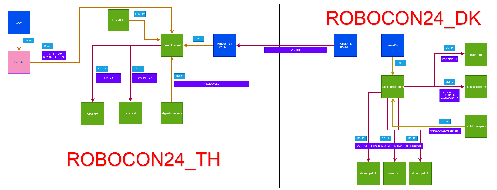

# Mã nguồn thiết kế chế tạo 2 robot giải đề ROBOCON 2024 của MTA
### FlowChart hệ thống 

### Ý tưởng hệ thống 
Sử dụng hệ thống đa MCU sử dụng kết nối I2C để liên kết hệ thống. 

### Nội dung
1. Đây là mã nguồn cho thiết kế chế tạo 2 robot giải đề ROBOCON2024.
   
### Kết quả
1. TOP 10/23 đội thi.
2. Đạt được 280/300 điểm thi đấu trải qua 64/167 ngày chế tạo, thử nghiệm robot.

### Lời cảm ơn
* Cảm ơn PSG. TS Dương Xuân Biên và các thầy Trung Tâm Công Nghệ (ATC) đã hổ trợ nhiệt tình.
* Cảm ơn các em Phùng Tiến Đạt, Hà Thành Đạt, Đỗ Văn Đức, Nguyễn Minh Duy đã tham gia team.

## Liên hệ
1. Tác giả : Phạm Hoàng Nam
2. Gmail : phn1712002@gmail.com 
